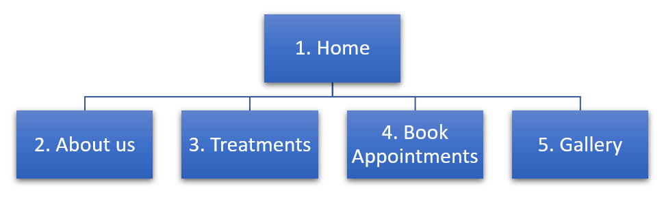
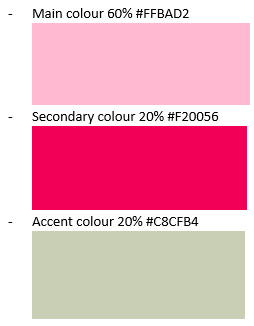

# Sarina Nails & Beauty #
- - - - 
  
[View the website in GitHub Pages](https://dijkm88.github.io/ms1/ "Milestone 1 Michael Dijk")
  
This is a project for a family member, who has recently started her own business in Manicure and Facial treatments (Make-up, skin care). She wanted a professional looking website, that would show to her (potential) customers that she's knowledgable, be able to showcase her previous work through a gallery, a source for new customers, a booking page or section, and a link to her social media accounts.  
  
With the creation of this website, we've not only achieved the goal of the client, but exceeded it, by offering her customers and new customers the ability to sign up for her newsletter. The newsletter can be used for special occasions i.e. holiday periods, where people in general want to look at their best, also, when there are new treatments available, or new products that she wants to offer her new and current customers.  
  
## UX ##
- - - - 
### For what users is this site created ###
Users of the site will be generally more leaning towards women, but not limited to, who are into nail care, and make up art / skin care, and would be between the age of 18 – 60s.

### Why is this site so special? ###
For users and potential customers, to be able to book appointments, look at a gallery of work done previously, generate leads by offering a newsletter for sending discounts to the e-mail, so customers could then book an appointment.

Linking in with Social Media: YouTube, Facebook, Twitter, Pinterest, and this way also have an increased brand-awareness, as customers could give reviews on here as well.

If we look at other sites, who offer the same options, sites do not look very inviting. By creating an inviting and elegant website, that’s responsive, build with the idea of mobile first then going towards the desktop, you will set a high standard, thus reflecting the idea to your potential customer that you also do deliver such standards in your work.

### Why would a user want this, and why has this site been created ###
A user would want this, as the site will give them access to do the following:
* Read reviews of previous customer
* Look at a gallery of work done previously, and creating an interest in booking an appointment
* Sign up for the available newsletter for potential discounts during the holiday period (i.e. christmas, birthday, you name it)
* Book appointments

### How is my project the best way to achieve this? ###
By providing a website, where the main topic is, __less is more__, I make a responsive site, which will show or build confidence to the visitor and potential customer. This is done by having high-resolution images, a gallery, testimonials in the future, and well written about me section, where the visitor can get to know the owner and see her certification, but most importantly by being visibile on the internet.

Due to the fact that I know the owner of this business, we've worked closely together to achieve the best possible outcome, towards both user and site owner. 

By delivering a clean and modern site, for this, I have used a one-page approach. Where customers just scroll from top to bottom.

We will use a tree structure using the burger icon on the top right of the page, the menu will collapse, with a modern font. 

### Colour Scheme ###
We have choosen 3 predominant colours.

Main colour #FFBAD2 is choosen as pink. As pink represents femininity, it's also often used to market products to women and young girls. Furthermore I've added 2 other accent colours to compliment the pink colour, as seen above.

When you're on the full desktop site, and hover over a link, the link will change style to confirm they are choosing / going to choose that option.

### User Stories ###
* As a potential customer, I want to have an easy overview of what type of treatments I could choose from, so I can make a decission about making an appointment.  
* As a potential customer and visitor to the site, I want to view the gallery, so I can see what type of treatments have been done previously, and I could decide if I want to make an appointment for a session.  
* As a new visitor to the site, I want the site to be easy to navigate, so I can find what I was looking for in an easy way.  
* As a potential customer, I want to read previous reviews, so I can see what others have to say to make my decission for booking in an appointment easier.  
* As a potential customer, I would like to read about the store/owner, so I get a better understanding if this is the right fit for myself.  
* As a new visitor and potential customer on the site, I want the bookings experience, to be easy and understandable.  
* As a new customer, I want to understand the opening / working hours, and where to go to in case of a booking.  

### Wireframes ###
[Home](assets/readme/wireframes/home.png "Home - Wireframe")  
[About](assets/readme/wireframes/about.png "About - Wireframe")  
[Services / Treatments](assets/readme/wireframes/services.png "Services / Treatments - Wireframe")  
[Bookings / Book Appointments](assets/readme/wireframes/booking.png "Booking - Wireframe")  
[Gallery](assets/readme/wireframes/gallery.png "Gallery - Wireframe")  

## Features ##
- - - - 
The website is created as a one-page design, featuring a navigation bar with a hamburger icon, the Hamburger icon in the navbar, is quite predominantly present, to get the users attention, to be able to move back and forth on the site. It's fully responsive and adapts from mobile to larger screens. In the footer section we have links to the business-owners social media pages. Every section features an introduction heading, and this is done so clear destinction can be made between each section of the page.  
  
__Home__  
  
The home section features a large full screen background, with the business's logo being the predominant image. The background is from one of the owners treatments with a gradient overlay, from pink in the top-left corner to the secundairy colour beige in the right bottom corner, we've made this stand out by incorporating the parallax scrolling effect.  
  
Furthermore it contains the motto/slogan of the owner: __"Beauty is confidence directly to your face and nails"__, and an introductory text: __"Welcome to Sarina nails & Beauty"__. Below this, we have 2 buttons, book now and price list. We have kept the home section of the site fairly clean, to have a maximum impact on the visitor with the logo, motto and call to action buttons to get the user and (potential) customer to look at the price list and then a direct booking option for returning customers.

The parallax scrolling is removed with a media query, as, some mobile devices like iOS and Android are not capable of processing this feature.  
  
__About__ 
  
The 2nd section on the page is the about section. Again, we have a section with a header using the parralax scrolling effect, which is overwritten by a media query for mobile phones and smaller screens, as this does not work correctly on those devices. Choosing the about section as the second section is done to create an interest in the owner and to showcase the certifications that the owner of the salon has received, for mobile view, we have a call to action button which says: "My Certification", and on larger screens, the certifications are listed as direct gallery images below the introduction. This is done so that the visitor and potential new customer is confident that once they make a booking with her salon, that they are in good hands.  
  
There is a small paragraph explaining to the visitor why she has choosen this proffesion, the location of where she normally does the treatments and her working hours, also, it's mentioned that if a certain treatment isn't listed, the visitor can discuss this with the owner, besides meeting at her address, she provides the option to meet on location, giving the visitor and potential customer a way to become familiar without leaving their comfort zone.  
  
__Treatments__  
  
The treatment section also starts with a header with a parallax scrolling effect, which is overwritten by a media query for smaller devices / screens. The treatments section has an introductory paragraph, explaining the process of how a (potential) customer can book, that when an booking has been made / requested, the owner will contact the customer to confirm booking: time, date and place. The treatments are currently at the owners home-address, but, that she can also meet on location for a small fee to accomadate for driving.  
  
Next part in the treatments section is the list of treatments. This includes a small paragraph explaining each treatment in detail, and current price. As the treatments section is located directly above the booking section, there was no need to include another call to action button to book, as once they scroll further down the list, both on Mobile as Desktop, they will notice the booking section.  
  
__Book An Appointment__
  
The Book An Appointment section, as all other sections on the page, start with a header for that section, that has an parralax scrolling effect, which is overwritten by a media query to have it set to a static image.  
  
Furthermore, there is an introductory paragraph, explaining the process once more, to reassure the (potential) customer of what will happen after it's booked.  
  
The contact form, which is currently used for bookings, has a dropdown, where the (potential) customer can select the treatment. This dropdown isn't required, but the remaining fields are mandatory fields. Once the booking is received, the owner will contact the customer, to confirm appointment and discuss the options.  
  
__Gallery__
  
The gallery section starts as with all other sections with a header, that has an parralax scrolling effect, which is overwritten by a media query to have it set to a static image for smaller size screens.  The header contains heading text, to confirm that the visitor is on the correct section of the page.  
  
The gallery itself has 2 column width on smaller screens like mobile phones, and will go to 4 column width for larger screens. Above the images itself, there is a small introduction which mentions that these images are made from work done in the past, and that the visitor can click on the image to see it in full-size.  
  
Once the image is clicked, the visitor can use their fingers to nagivate back and forth, as we are utilizing Fancybox. Also, Fancybox incorporates a slide-show feature, which will run and show each image for several seconds before moving onto the next. Each image once opened full-size with fancybox, has a small paragraph explaining what treatment has been done.  
  
Once the user nears the end of the gallery section, there are 2 call to action buttons as we had on our home section, one is for going to the booking section, the other one is for going to the treatments section. This is done, as once the images have been seen, the visitor can decide to book an appointment, or go back to the treatments list, and see what treatments will suit the visitor.  
  
### Existing Features ###
- Header Logo is visible on the top left corner of the page, once the logo is clicked, this will bring you back to the top of the page.  
- The Header Navigation bar including it's Hamburger Menu, is visible on mobile view and larger screens including desktop view. We've kept the Hamburger Menu, to keep the design clean and minimalistic  
- We have 2 call to action buttons on the "home" section of the page, they are linked to the booking form and price list. For returning customers/visitors, they can easily book a new appointment, and for new visitors/users they can immediately click on the pricelist button to see the different treatments and prices that go along with those  
- In the footer section, we've included links to all the owners social media platforms, and if these links are clicked, they are opened in a new window  
- We've included a "scroll to top" button in the bottom right corner, in case a user/visitor wants to scroll back up and look at other sections - this allows better user experience as opposed to opening the hamburger menu and clicking on a new link  
- The about section includes a modal button, which once clicked, opens a modal showing all the different certifications from the owner, to display the certifications of the owner, we applied a Fancybox viewer.
- The about section shows a general map of Amsterdam, as this is the city that the owner is residing her business in, and, below this we have an address and phone number for contact details
- The Treatments section, offers a price-list and explains each treatment in full detail
- The Book Appointments section, offers an introduction in the bookings process, the form includes form-validation, which is checked by the browser by using the form class needs-validation, further when they book an appointment, they have the option to check the "Subscribe to newsletter" - to be included in future promotions done by the newsletter. In turn this generates more leads in the future.
- The gallery makes use of a Fancybox viewer, and each image has a small paragraph detailing what has been done in those images. Below the gallery, we have 2 call-to-action buttons again, 1 will lead to book now, the other will lead to the price-list, which is situated above the booking form.
- Each section heading has a parallax scrolling effect for desktop view. This is overwritten by a media query for smaller (mobile) screens, as after testing, we discovered that this did not work/apply to those screens.

  
### Features left to implement in future releases ###
* A toggle button for English / Dutch, as the site-owner has her business in Amsterdam, The Netherlands. This way, the site is able to be attractive to not only native speaking people from the Netherlands, but also English speaking people who live in the Netherlands, or who search for a nail salon online.  
* Google Analytics - for understanding what a customer does, where they come from, and, to adjust the customers furture advertisement needs (Youtube, Facebook, Groupon)
* Insert a GDPR pop-up, to notify the visitor, and, giving them the option to agree on the tracking terms, or to refuse them
* A full booking experience, where the user can select a date and slot, and, immediately pay online, guarranteeing the business owner revenue even if the person who booked the session does not show up.
* A backend to have the contact-form actually send through data to the owner. Extract e-mail address for mailing list when they opted in for the mailing list

## Technology used ##
- - - - 
* The project has been realized with __HTML__, __CSS__.
* The project uses __Auto Prefixer__ to make sure code is aligned on all different browsers -  [Auto Prefixer](https://autoprefixer.github.io/ "Autoprefixer CSS online")  
* The project uses __Fancybox__ for both the gallery section and the certification section -  [Fancybox](http://fancyapps.com/fancybox/3/ "Fancybox 3")  
* The project uses __Material Design for Bootstrap__ MDB Bootstrap 4.8.5 -  [MDB](https://mdbootstrap.com/ "MDB")  
* The project also used __Font Awesome__ - release 5.8.2 to supply icons -  [Font Awesome](https://fontawesome.com/ "Font Awesome")  
* The project uses __Google Fonts__ to style the website fonts -  [Google Fonts](https://fonts.google.com/ "Google Fonts")  
* The project uses __Popper.js__ for Javascript popups and responsive navigation - [Popper.js](https://popper.js.org/ "Popper.js")  
* The project uses __Pixabay__ for a license free backgound for the Book An Appointment section header - [Pixabay](https://pixabay.com/ "Pixabay")  

## Testing ##
- - - - 
The website's code and it's validity has been tested by using:
- [W3C CSS Validation Service](https://jigsaw.w3.org/css-validator/ "CSS Validation service")  
- [W3C Markup Validation Service](https://validator.w3.org/ "Markup Validation Service")  

## User story testing ##
1 As a potential customer, I want to have an easy overview of what type of treatments I could choose from, so I can make a decission about making an appointment.  
	i. The user and potential customers arrives at the website
	ii. Once at the website, the home section has 2 clear call-to-action buttons, one is "book now" and the other one is "treatments"
	iii. The user and potential customer can click on the call-to-action button "treatments" and is then immediately taken to the treatments section
	iiii. Once arrived in the treatments section, there is a small introductory paragraph, detailing how the booking experience will be, and how it's going to be confirmed.
	iiiii. It the user and potential customer decides to book, we've purposely not added a call-to-action button, as the booking form is situated directly below the treatments section
	iiiiii. The user and potential customer can then decide to book, or go back up to the home section of the site, by using the "up" arrow in the bottom right corner, or, to use the hamburger menu and click home - for both options the user will be taken to the top of the site.
2 As a potential customer and visitor to the site, I want to view the gallery, so I can see what type of treatments have been done previously, and I could decide if I want to make an appointment for a session.  
3 As a new visitor to the site, I want the site to be easy to navigate, so I can find what I was looking for in an easy way.  
4 As a potential customer, I want to read previous reviews, so I can see what others have to say to make my decission for booking in an appointment easier.  
5 As a potential customer, I would like to read about the store/owner, so I get a better understanding if this is the right fit for myself.  
6 As a new visitor and potential customer on the site, I want the bookings experience, to be easy and understandable.  
7 As a new customer, I want to understand the opening / working hours, and where to go to in case of a booking. 

## Deployment ##
- - - - 
This project was worked on through a local IDE, with the integration of [git --everything-is-local](https://git-scm.com/download/win "git --everything-is-local"), which allowed to push to GitHub after installation on local machine.  
  
The project has been deployed on Github pages, and I've performed the following steps to make it accessible after committing to Github:
1. Login into [Github](https://www.github.com/ "Github").
2. From the list of available repositories, the correct repository was choosen: __dijkm88/ms1__.
3. Once the repository was opened, *Settings* was selected from the 2nd menu on the top.
4. Once in the *Settings* page, scrolled down to the bottom, where it mentions __GitHub Pages__.
5. The correct *source* was then selected, this was set to *Master Branch*.
6. Once *Master Branch* was selected, the page was then automatically refreshed and under __GitHub Pages__ you will then see: "__*Your site is ready to be published at https://dijkm88.github.io/ms1/.*__"
7. After the link was then retrieved under the __GitHub Pages__ section, the repository index was then updated to reflect the correct link on top, and to do so, the following steps where performed:
	1. On the repository index, we selected *Edit* just below the second menu on top right.
	2. The correct Repository name was then added with it's corresponding GitHub.io [link](https://dijkm88.github.io/ms1/ "Link to live website")
  
### How to run this project locally ###
To clone this project to a local IDE, from GitHub:
1. Open GitHub, and navigate to the repository page [GitHub - Milestone 1](https://github.com/dijkm88/ms1 "Milstone 1 GitHub Repository")
2. Under the repository name, click "Clone or download"
3. In the Clone with HTTPS section, click to copy the clone URL for the repository
4. Open Git Bash in your local IDE
5. Change the working directory to the directory where you want the cloned directory to be made
6. type `git clone'`, and then paste the URL that you've retrieved in step 3.  
`git clone https://github.com/dijkm88/ms1.git`
7. Press Enter. Your local clone will be created.  
`git clone https://github.com/dijkm88/ms1.git`  
`Cloning into 'ms1'...`  
`remote: Enumerating objects: 75, done.`  
`remote: Counting objects: 100% (75/75), done.`  
`remote: Compressing objects: 100% (58/58), done.`  
`Rremote: Total 539 (delta 19), reused 71 (delta 17), pack-reused 464 iB/s`  
`Receiving objects: 100% (539/539), 22.62 MiB | 3.77 MiB/s, done.`  
`Resolving deltas: 100% (205/205), done.`  
8. After receiving confirmation that clone was "done", you can then open/work on the files in the designated folder

## Credits ##
- - - - 

### Content ###
* The Dutch texts have been created by the site-owner (which will be implemented once we are able to insert a toggle button for the language switch).
* The English texts have been translated from the original Dutch texts by Michael Dijk.  

### Media ###
Some images have been sourced from pixabay.  
- Agenda image for appointments section header (Image is Free For Commercial Use) [Agenda Image](https://pixabay.com/photos/day-planner-calendar-organizer-828611/ "Agenda Image") 
- Nail polish image for the treatments section header  (Image is Free For Commercial Use) [Nail Polish Image](https://pixabay.com/photos/manicure-pedicure-cosmetics-870857/ "Nail Polish Image") 
  
All digital materials has been provided by the site-owner.
- Gallery images (certification & gallery)  

### Code ###
* I used text-shadow generator from [HTML - CSS - JS: The Client-Side Of The Web](https://html-css-js.com/css/generator/text-shadow/ "Text Shadow Generator")  
* I found a script using Jquery on stack overflow, to auto-hide menu after clicking [Stack Overflow](https://stackoverflow.com/questions/42401606/how-to-hide-collapsible-bootstrap-4-navbar-on-click/ "Auto hide Hamburger Menu")  
* I discovered Fancybox [Fancybox](http://fancyapps.com/fancybox/3/ "Fancybox") from Anna Graeves, Code Institute student 2019 - and with her permission used and adapted some of her code to include it into this website  
* I applied a smooth-scroll script from W3Schools [W3 School](https://www.w3schools.com/howto/howto_css_smooth_scroll.asp#section1 "Smooth Scroll Script")  
* I applied a scroll-to-top script from the website [scrolltotop.com](https://www.scrolltotop.com/ "Scroll to Top")  
  
### Acknowledgements ###
* I received a lot of inspiration for the design from: uxplanet.  
* I found a lot of answers on queries that I had in relation to my coding on [Stack Overflow](https://stackoverflow.com "Stack Overflow")  
* I used some sites for helping me choose the right colour scheme:  
- [WebsiteBuilderExpert](https://www.websitebuilderexpert.com/designing-websites/how-to-choose-color-for-your-website/ "How to Choose Good Website Color Scheme")  
- [Color Combos](https://www.colorcombos.com/color-scheme-126.html/ "Colour Combinations Tester")  